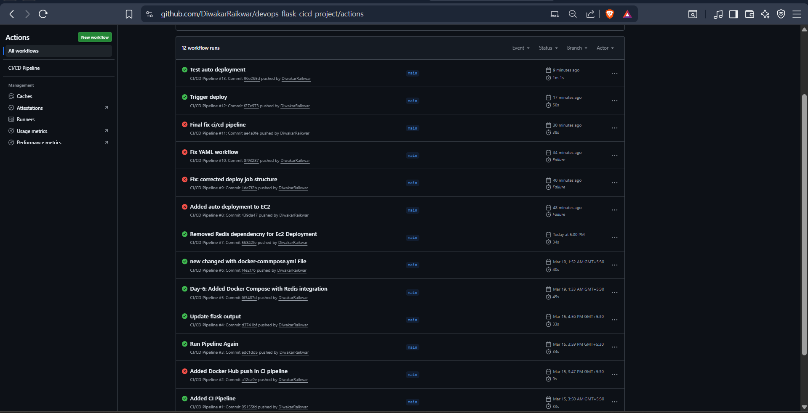
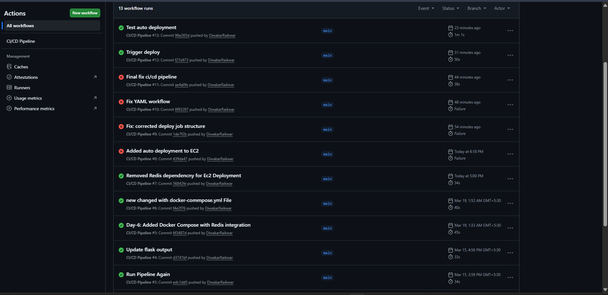
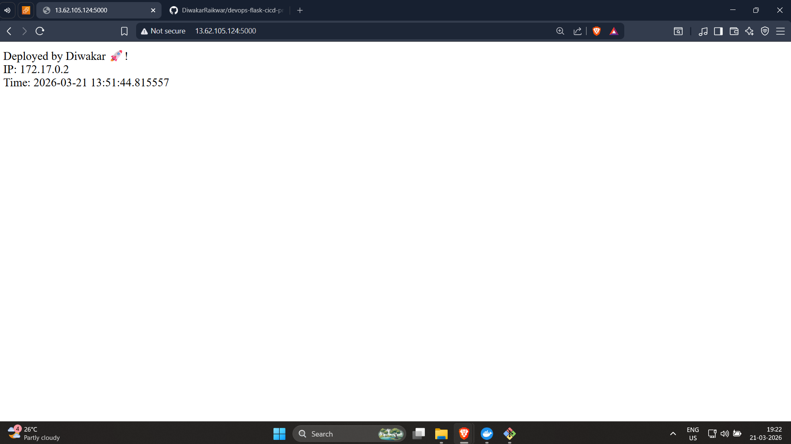

\# 🚀 DevOps Flask CI/CD Project

\## 📌 Project Overview

This project demonstrates a complete DevOps pipeline by building, containerizing, and deploying a Flask application using Docker, GitHub Actions, and AWS EC2 with automated CI/CD.

---

\## 🛠️ Tech Stack

\- Python (Flask)

\- Docker

\- GitHub Actions (CI/CD)

\- AWS EC2

\- Docker Hub

---

\## ⚙️ Features

\- Containerized Flask application using Docker

\- CI pipeline to build and push Docker image

\- CD pipeline to automatically deploy on AWS EC2

\- Live application accessible via public IP

---

\## 🔄 CI/CD Pipeline Flow

Code Push → GitHub Actions → Build Docker Image → Push to Docker Hub → Auto Deploy to EC2 → Live Application

---

\## 🌍 Live Demo

http://13.62.105.124:5000 (It's a dynamic IP, so it will get change every time when we stop or restart the  AWS Instance. Elastic IP can be used to remain it as it is. 

---

\## 📸 Screenshots

### 🔹 CI/CD Pipeline
 &  

### 🔹 Live Application

### 🔹 Docker process

---

\## 🧠 Learnings

\- Docker containerization

\- CI/CD automation

\- Cloud deployment on AWS

\- Debugging real-world issues

---

\## 👨‍💻 Author

Diwakar

